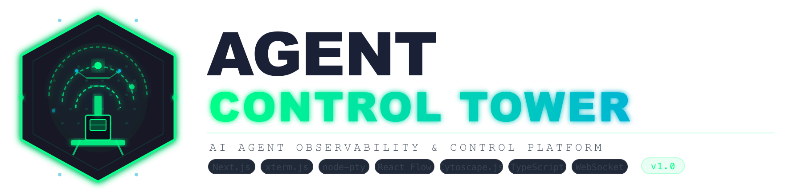
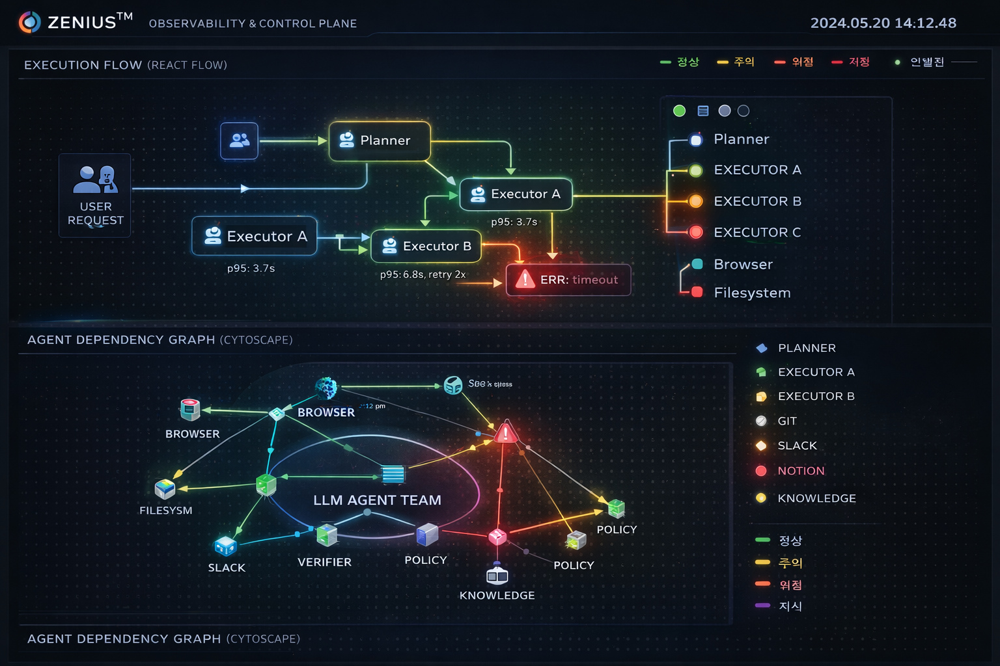

<div align="center">



<br/>
<br/>

[](https://nextjs.org/)
[](https://www.typescriptlang.org/)
[](https://react.dev/)
[](https://nodejs.org/)
[](https://developer.mozilla.org/en-US/docs/Web/API/WebSocket)
[](LICENSE)

<br/>

> **AI 에이전트 실시간 모니터링 & 통합 제어 대시보드**
> Real-time AI Agent Observability & Control Platform

<br/>

---

</div>

## ✨ 개요 | Overview

**Agent Control Tower**는 여러 AI 에이전트를 한 곳에서 모니터링하고 제어할 수 있는 **풀스택 NOC(Network Operations Center) 스타일 대시보드**입니다.

AI 에이전트가 급증하는 시대, 당신의 에이전트들이 **지금 어디서 무엇을 하는지** 한눈에 파악하세요.

> *"Agent Control Tower is like mission control for your AI agents — real-time topology, terminal access, and live metrics in one dark-mode dashboard."*

<br/>

---

## 🖥️ 화면 미리보기 | Preview

<div align="center">



*실행 흐름 맵 · 에이전트 의존성 그래프 · 실시간 메트릭스*

</div>

<br/>

---

## 🚀 핵심 기능 | Features

<table>
<tr>
<td width="50%">

### 📡 관제 대시보드
- **실행 흐름 맵** (React Flow) — 에이전트 간 실시간 데이터 흐름 시각화
- **의존성 그래프** (Cytoscape.js) — 서비스 연결 토폴로지
- **실시간 메트릭스** — CPU, 메모리, 요청 처리율 라이브 차트
- **이벤트 로그** — 에이전트 활동 타임라인 스트리밍

</td>
<td width="50%">

### 🔧 에이전트 설정
- **에이전트 CRUD** — 에이전트 추가/수정/삭제
- **인프라 맵** — 중앙 코어 + 궤도 회전 노드 (드래그/클릭 제어)
- **호버 팝오버** — 각 역할별 기능 정보 표시
- **상태 모니터링** — 에이전트별 리소스 사용량 추적

</td>
</tr>
<tr>
<td width="50%">

### 💻 프로젝트 터미널
- **실제 쉘 연동** — xterm.js + node-pty 기반 완전한 터미널
- **분할 화면** — 수평/수직 멀티 패널 (최대 6개)
- **명령 단축 버튼** — Claude Code · Codex CLI · tmux 원클릭 실행
- **세션 영속** — 탭 이동 후에도 터미널 세션 유지
- **디렉토리 브라우저** — 프로젝트 폴더 탐색 & 즉시 이동

</td>
<td width="50%">

### 🎨 터미널 커스터마이징
- **4가지 테마** — Kaku Dark · NOC Green · Monokai · Dracula
- **6가지 폰트** — Menlo · JetBrains Mono · Fira Code · D2Coding · MesloLGS NF 등
- **커서 스타일** — Block · Underline · Bar
- **투명도 · 폰트크기** — 슬라이더로 즉시 조절
- **설정 영구 저장** — localStorage 자동 동기화

</td>
</tr>
</table>

<br/>

---

## 🏗️ 기술 스택 | Tech Stack

```
┌─────────────────────────────────────────────────────────────┐
│                     AGENT CONTROL TOWER                     │
│─────────────────────────────────────────────────────────────│
│  Frontend          │  Terminal           │  Backend          │
│──────────────────  │  ─────────────────  │  ───────────────  │
│  Next.js 15.1      │  xterm.js v6        │  WebSocket (ws)  │
│  React 19          │  node-pty (multi)   │  Node.js 18+     │
│  TypeScript 5      │  @addon/fit         │  API Routes      │
│  Tailwind CSS 4    │  @addon/web-links   │  File System API │
│                    │                     │                   │
│  Visualization     │  Graph Engine       │  State           │
│──────────────────  │  ─────────────────  │  ───────────────  │
│  Recharts          │  React Flow         │  useReducer      │
│  CSS Animations    │  Cytoscape.js       │  localStorage    │
│  SVG / Canvas      │  @xyflow/react      │  Immutable State │
└─────────────────────────────────────────────────────────────┘
```

<br/>

---

## 📦 설치 가이드 | Installation

### 사전 요구사항 | Prerequisites

| 도구 | 버전 | 다운로드 |
|------|------|----------|
| Node.js | 18.0+ | [nodejs.org](https://nodejs.org/) |
| npm | 9.0+ | Node.js에 포함 |
| Git | 최신 | [git-scm.com](https://git-scm.com/) |

<br/>

### 🍎 macOS 설치

```bash
# 1. 저장소 클론
git clone https://github.com/your-username/agent-control-tower.git
cd "agent control tower"

# 2. 의존성 설치
npm install

# 3. 개발 서버 시작 (터미널 서버 + Next.js 동시 실행)
npm run dev:all
```

> **터미널 서버 별도 실행 (선택)**
> ```bash
> # 터미널 서버만 실행 (port 3001)
> npm run dev:terminal
>
> # Next.js만 실행 (port 3000)
> npm run dev
> ```

브라우저에서 **http://localhost:3000** 접속

<br/>

**Homebrew 환경 권장 설정**

```bash
# Homebrew 설치 (없는 경우)
/bin/bash -c "$(curl -fsSL https://raw.githubusercontent.com/Homebrew/install/HEAD/install.sh)"

# Node.js 설치
brew install node

# nvm 사용 (버전 관리 권장)
brew install nvm
nvm install 20
nvm use 20
```

<br/>

**macOS 문제 해결**

<details>
<summary>🔧 node-pty 빌드 실패 시</summary>

```bash
# Xcode Command Line Tools 설치
xcode-select --install

# node-pty 재빌드
npm rebuild @homebridge/node-pty-prebuilt-multiarch
```

</details>

<details>
<summary>🔧 포트 충돌 시</summary>

```bash
# 3000, 3001 포트 사용 중인 프로세스 종료
lsof -ti:3000,3001 | xargs kill
```

</details>

<br/>

---

### 🪟 Windows 설치

> **⚠️ Windows에서는 WSL2 (Windows Subsystem for Linux) 사용을 강력 권장합니다.**
> node-pty가 실제 PTY 환경을 필요로 하기 때문입니다.

<br/>

**방법 1: WSL2 (권장)**

```powershell
# PowerShell (관리자 권한) 에서 WSL2 설치
wsl --install

# Ubuntu 배포판 설치 후 WSL 터미널 진입
wsl

# WSL 내에서 Node.js 설치 (nvm 사용)
curl -o- https://raw.githubusercontent.com/nvm-sh/nvm/v0.40.0/install.sh | bash
source ~/.bashrc
nvm install 20
nvm use 20

# 저장소 클론 및 실행
git clone https://github.com/your-username/agent-control-tower.git
cd "agent control tower"
npm install
npm run dev:all
```

브라우저에서 **http://localhost:3000** 접속

<br/>

**방법 2: Windows 네이티브**

> ⚠️ 터미널 분할 기능이 제한될 수 있습니다.

```powershell
# 1. Node.js 설치
# https://nodejs.org/ 에서 LTS 버전 다운로드

# 2. windows-build-tools 설치 (관리자 PowerShell)
npm install --global windows-build-tools

# 3. 저장소 클론
git clone https://github.com/your-username/agent-control-tower.git
cd "agent control tower"

# 4. 의존성 설치
npm install

# 5. 실행
npm run dev:all
```

<br/>

**Windows 문제 해결**

<details>
<summary>🔧 MSBUILD 오류 시</summary>

```powershell
# Visual Studio Build Tools 설치
# https://visualstudio.microsoft.com/visual-cpp-build-tools/
# "C++ build tools" 워크로드 선택

# 또는 chocolatey로 설치
choco install visualstudio2022buildtools --package-parameters "--add Microsoft.VisualStudio.Workload.VCTools"
```

</details>

<details>
<summary>🔧 PowerShell 실행 정책 오류 시</summary>

```powershell
# 관리자 권한 PowerShell에서
Set-ExecutionPolicy -ExecutionPolicy RemoteSigned -Scope CurrentUser
```

</details>

<br/>

---

## ⚡ 사용법 | Usage

### 탭 구성

| 탭 | 기능 |
|----|------|
| 🖥️ **관제 대시보드** | 에이전트 토폴로지 맵, 실시간 메트릭스, 이벤트 로그 |
| ⚙️ **에이전트 설정** | 에이전트 관리 CRUD, 인프라 맵, 상태 현황 |
| 🚀 **프로젝트 시작** | 터미널 대시보드, 디렉토리 브라우저, 분할 화면 |

<br/>

### 터미널 단축 기능

```
툴바 버튼:
  [🤖 Claude]  → claude 명령 즉시 실행
  [◯ Codex]   → codex 명령 즉시 실행
  [▦ tmux]    → tmux 세션 시작
  [— 수평분할] → 현재 패널을 위아래로 분할
  [| 수직분할] → 현재 패널을 좌우로 분할
  [되돌아가기] → 모든 분할 해제, 초기 상태로 복귀
```

<br/>

### package.json 스크립트

```json
{
  "dev":          "Next.js 개발 서버 (port 3000)",
  "dev:terminal": "WebSocket 터미널 서버 (port 3001)",
  "dev:all":      "두 서버 동시 실행",
  "build":        "프로덕션 빌드",
  "start":        "프로덕션 서버 실행"
}
```

<br/>

---

## 📁 프로젝트 구조 | Project Structure

```
agent control tower/
├── 📁 scripts/
│   └── terminal-server.ts      # WebSocket + node-pty 터미널 서버
├── 📁 src/
│   ├── 📁 app/
│   │   ├── page.tsx            # 메인 페이지 (탭 라우팅)
│   │   ├── layout.tsx          # 앱 레이아웃
│   │   └── 📁 api/
│   │       ├── agents/         # 에이전트 CRUD API
│   │       └── fs/             # 파일시스템 브라우저 API
│   ├── 📁 components/
│   │   ├── 📁 terminal/        # 터미널 대시보드 컴포넌트
│   │   │   ├── TerminalPane.tsx        # 개별 터미널 패널
│   │   │   ├── SplitContainer.tsx      # 재귀 분할 컨테이너
│   │   │   ├── ToolbarCommandButtons.tsx
│   │   │   ├── TerminalCustomizer.tsx
│   │   │   └── DirectoryPanel.tsx
│   │   ├── 📁 topology/        # React Flow 토폴로지 맵
│   │   ├── 📁 settings/        # 에이전트 설정 페이지
│   │   ├── 📁 left/            # 에이전트 목록 패널
│   │   ├── 📁 right/           # 실시간 메트릭스 차트
│   │   └── 📁 bottom/          # 이벤트 로그
│   ├── 📁 hooks/
│   │   ├── useTerminalConfig.ts # 터미널 설정 (localStorage)
│   │   └── usePaneManager.ts   # 분할 창 상태 관리
│   ├── 📁 types/
│   │   └── terminal.ts         # 타입 정의
│   ├── 📁 data/
│   │   ├── terminalThemes.ts   # 테마 프리셋
│   │   └── agentSettingsData.ts
│   └── 📁 utils/
│       └── splitTreeUtils.ts   # 이진 트리 분할 유틸
└── 📁 docs/                    # 설계 문서
```

<br/>

---

## 🏛️ 아키텍처 | Architecture

```
┌─────────────────────────────────────────────────────────────┐
│                      Browser (Next.js)                      │
│                                                             │
│  ┌─────────────┐  ┌──────────────┐  ┌───────────────────┐ │
│  │  Dashboard  │  │   Settings   │  │  Terminal (ACT)   │ │
│  │  - ReactFlow│  │  - Orbital   │  │  - xterm.js       │ │
│  │  - Cytoscape│  │    InfraMap  │  │  - SplitContainer │ │
│  │  - Recharts │  │  - CRUD UI   │  │  - DirectoryPanel │ │
│  └─────────────┘  └──────────────┘  └─────────┬─────────┘ │
│                                                │WebSocket  │
└────────────────────────────────────────────────┼───────────┘
                                                 │
                              ┌──────────────────▼──────────┐
                              │  terminal-server.ts          │
                              │  WebSocket Server :3001      │
                              │  ┌────────┐  ┌────────────┐ │
                              │  │ PTY #1 │  │ PTY #2 ... │ │
                              │  │  zsh   │  │    zsh     │ │
                              │  └────────┘  └────────────┘ │
                              └─────────────────────────────┘
```

**핵심 설계 원칙:**
- **불변 상태 패턴** — 모든 상태 업데이트는 새 객체 생성 (useReducer)
- **이진 트리 분할** — tmux 방식의 재귀 패널 분할 모델
- **CSS 세션 영속성** — `display:none`으로 터미널 마운트 유지
- **다중 PTY** — 패널마다 독립 WebSocket + PTY 프로세스

<br/>

---

## 🤝 기여 | Contributing

```bash
# 1. Fork 후 클론
git clone https://github.com/your-username/agent-control-tower.git

# 2. 피처 브랜치 생성
git checkout -b feat/amazing-feature

# 3. 변경 후 커밋
git commit -m "feat: add amazing feature"

# 4. Push & PR
git push origin feat/amazing-feature
```

<br/>

---

## 📄 라이선스 | License

This project is licensed under the **MIT License** — see the [LICENSE](LICENSE) file for details.

<br/>

---

<div align="center">

**Built with ❤️ for the AI Agent era**

<br/>

*Agent Control Tower — Where AI agents come to be monitored.*

<br/>

[](https://github.com/your-username/agent-control-tower)

</div>
